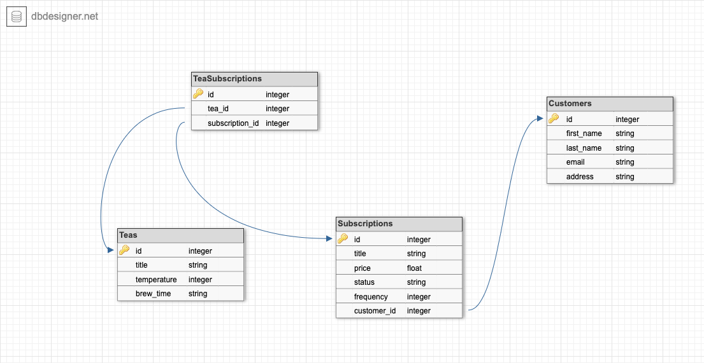

<div align="center">
  <h1>Tea Subscription Service API</h1>
</div>

<br>

# Table of Contents

- [Project Overview](#project-overview)
- [Setup](#setup)
- [Tech and Tools](#tech-and-tools)
- [Schema](#schema)
- [Endpoints](#endpoints)
- [Future Goals](#future-goals)
- [Contributors](#contributors)

# Project Overview 

Tea Subscription Service REST API was developed in under 8 hours as part of Turing's [technical challenge take home](https://mod4.turing.edu/projects/take_home/take_home_be) practice. This API demonstrates my strong understanding of Ruby on Rails and my ability to create restful routes as well as well-organized code that follows OOP. Tea Subscription Service was built using test driven development and behavior driven development for error handling. A GitHub project board was used to manage tickets as the API was developed. The schema was developed so that a subscription belongs to a customer, and a customer can have many subscriptions. Additionally, a subscription can have many teas and a tea can be a part of many subscriptions. If developed further, I would incorporate additional endpoints to return what teas are included in a subscription and choosing teas for a subscription. CircleCI was used for continuous integration. 


# Setup 

1. Clone the repository
2. cd into the root directory
3. Install gem packages: `bundle install`
4. Setup the database: `rails db:{drop,create,migrate,seed}`
5. You may run the RSpec test suite locally with `bundle exec rspec`
6. Open the coverage report with `open coverage/index.html`, testing coverage maintained at 100% 
7. Run the server locally with `rails s`
8. Navigate to http://localhost:3000 in your browser and explore the [endpoints](#endpoints) listed below


# Tech and Tools 

## Built With

-  **2.7.2**
-  **5.2.8.1**
-  **3.12.0**
- 
- 
- 
- 

## Gems Used

- [Pry](https://github.com/pry/pry-rails)
- [Capybara](https://github.com/teamcapybara/capybara)
- [RSpec](https://github.com/rspec/rspec-metagem)
- [Simple-Cov](https://github.com/simplecov-ruby/simplecov)
- [Factory Bot for Rails](https://github.com/thoughtbot/factory_bot_rails)
- [Faker](https://github.com/faker-ruby/faker)
- [Shoulda Matchers](https://github.com/thoughtbot/shoulda-matchers)


# Schema 




# Endpoints
- The exposed endpoints are detailed below and can be run locally

- Local Backend Server: http://localhost:3000

[](https://app.getpostman.com/run-collection/24609974-3d26f193-2594-4edd-b4bf-e2772db857c7?action=collection%2Ffork&collection-url=entityId%3D24609974-3d26f193-2594-4edd-b4bf-e2772db857c7%26entityType%3Dcollection%26workspaceId%3Da70ba617-8cde-4bdd-af65-e392a67fcdc0)

<details close>
<summary>Subscribe a Customer to a Tea Subscription</summary>
<br>

Request: <br>
```
POST /api/v1/customers/#{customer.id}/subscriptions 
```

Request Body: 
```json 
{
  "title": "Mint",
  "price": 40,
  "status": "Active",
  "frequency": 10
}

```

JSON Response Example:
```json 
{
    "data": {
        "id": "68",
        "type": "subscription",
        "attributes": {
            "customer_id": 1,
            "title": "Mint",
            "price": 40.0,
            "status": "Active",
            "frequency": 10
        }
    }
}


```
</details>

<details close>
<summary>Cancel a Customer's Tea Subscription</summary>
<br>

Request: <br>
```
PATCH /api/v1/customers/#{customer.id}/subscriptions/#{subscrption.id} 
```

Request Body: 
```json 
{
  "status": "Cancelled"
}
```

JSON Response Example:
```json 
{
  "message": "Subscription status is now: Cancelled"
}


```
</details>

<details close>
<summary>Get all of a customer's subscriptions</summary>
<br>

Request: <br>
```
GET /api/v1/customers/#{customer.id}/subscriptions
```


JSON Response Example:
```json 
{
    "data": [
        {
            "id": "66",
            "type": "subscription",
            "attributes": {
                "customer_id": 1,
                "title": "Earl Grey",
                "price": 30.0,
                "status": "Cancelled",
                "frequency": 10
            }
        },
        {
            "id": "68",
            "type": "subscription",
            "attributes": {
                "customer_id": 1,
                "title": "Mint",
                "price": 40.0,
                "status": "Cancelled",
                "frequency": 10
            }
        },
        {
            "id": "60",
            "type": "subscription",
            "attributes": {
                "customer_id": 1,
                "title": "Earl Grey",
                "price": 30.0,
                "status": "Active",
                "frequency": 10
            }
        },
        {...},
        {...}
```
</details>

# Future Goals 
- Additional endpoints to get a list of teas in a subscription, choose teas for a subscription, get only active subscriptions for a customer, and more 
- Incorporate continuous deployment to Heroku using CircleCI 
- Build a small frontend using React for practice 

# Contributors 

<table>
  <tr>
    <td></td>
  </tr>

  <tr>
    <td><div align="center"><strong>Emily Port</strong></div></td>

  </tr>

  <tr>
    <td>
      <div align="center">
        <a href="https://github.com/eport01">GitHub</a><br>
        <a href="https://www.linkedin.com/in/emily-port-3ab6389b/">LinkedIn</a>
      <div>
    </td>
  </tr>
</table>